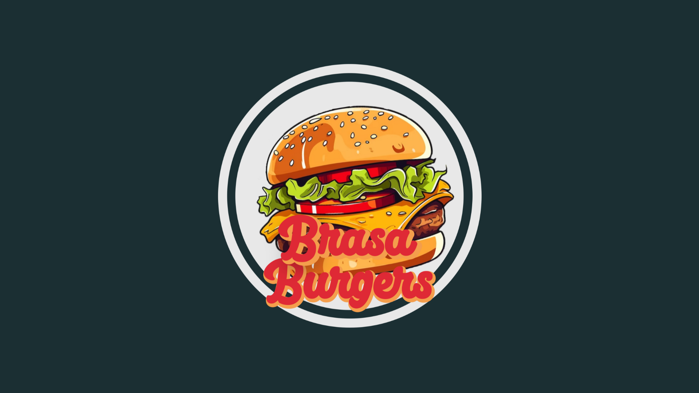

# BrasaBurgers




> **BrasaBurgers** é um aplicativo mobile de gerenciamento de pedidos para uma loja de fast food. O usuário pode visualizar os produtos, escolher a quantidade desejada e montar seu pedido de forma prática e intuitiva.

---

## ➕ Sobre o projeto

O **BrasaBurgers** foi desenvolvido para otimizar o processo de atendimento de uma hamburgueria, facilitando tanto para os clientes quanto para os atendentes.  

O aplicativo foi desenvolvido utilizando **React Native**, com foco na simplicidade, rapidez e boa experiência de usuário.  

Este projeto foi realizado como trabalho de conclusão do curso de **Informática Completa**, sob orientação do professor **Gustavo Ferreira**.

---

## 🚀 Funcionalidades

- 📜 Visualização do catálogo de produtos.
- ➕ Adição de produtos ao pedido.
- 🔢 Seleção da quantidade de cada item.
- 🛒 Gerenciamento de pedidos.
- ✔️ Interface simples, objetiva e responsiva.

---

## 🔧 Tecnologias utilizadas

- **React Native** — Desenvolvimento mobile (Android e iOS)
- **JavaScript** — Linguagem de programação principal
- **Expo** — Ferramenta para facilitar o desenvolvimento React Native
- **Node.js** — Ambiente de execução para dependências

---

## 🚀 Como rodar o projeto

### Pré-requisitos:
- Node.js instalado
- Expo CLI instalado globalmente (`npm install -g expo-cli`)

### Siga os passos:

```bash
# Clone o repositório
git clone https://github.com/Vini150cius/BrasaBurgers.git

# Acesse a pasta do projeto
cd BrasaBurgers

# Instale as dependências
npm install

# Execute o projeto
npm start

```

## 📝 Licença

Este projeto é de livre utilização para fins de estudo ou como base para outros projetos. Caso utilize, peço gentilmente que mantenha os devidos créditos.
